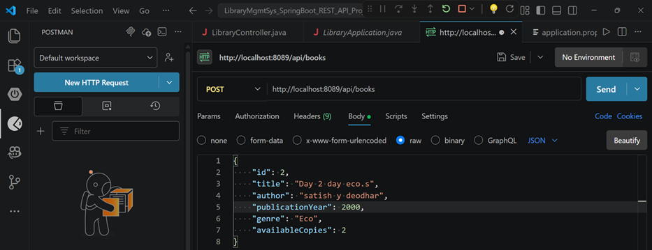
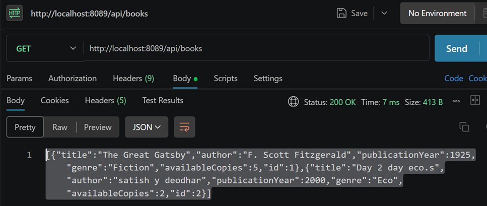
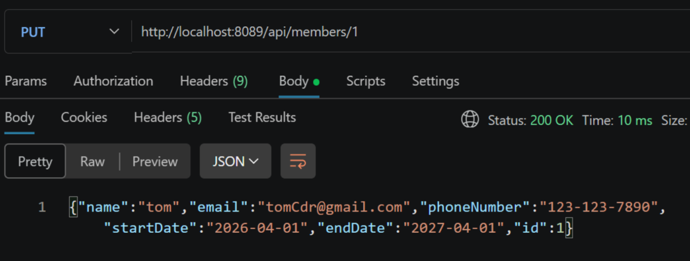
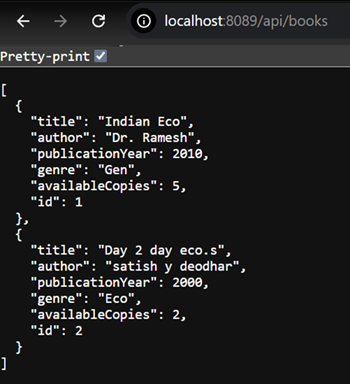

# 📚 LMS - Version 1 (Basic)

This is the **initial version** of the Library Management System.

---

## 🚀 Features

- Add Books
- View Books
- Add Members
- View Members
- Logging added (SLF4J)
---

## 👉 Focus:
- Understanding API flow
- Introduction to logging for debugging and tracking requests

---

## 🧱 Architecture
Controller → Service

- No Repository layer
- Data stored using ArrayList (in-memory)

---

## 📌 Key Points

- Simple structure for beginners
- Focus on understanding API flow
- No error handling
- No update/delete functionality

---

## 🔧 Example APIs

### Add Book
POST /api/books

### Get All Books

GET /api/books

### Add Member

POST /api/members

---

## 📝 Logging (SLF4J)

Logging is used to track application behavior and debug issues.

We use **SLF4J (Simple Logging Facade for Java)**:

- `logger.info()` → Normal operations (e.g., data fetched)
- `logger.warn()` → Warnings (e.g., book not found)
- `logger.error()` → Errors

👉 Logs are printed in the Spring Boot console.

Example:
INFO Book added: Java
WARN Book not found with id: 10

--- 

## ❗ Limitations

- No validation
- No "not found" handling
- No borrow/return system
- Data lost on restart

---

## 🎯 Learning Goal

- Understand Controller & Service interaction
- Learn basic REST APIs

---

## O/P images  

1- 2 books added in books repo (in memory using arralist).
Added using POST req – 

  

 
---

2- Op can be seen using GET request – 

  

** update book id 1 –  PUT reqd -- 
 Op on browser –  http://localhost:8089/api/books

---

3- ^^^^^^ MEMBER MODEL 

** Add data in member -  POST req …
Op in postman  --- 

  

---
apznek1 

4-
Op on browser --- GET REQ FOR MEMBER MODEL

  

--- 

*************************************
*************************************

