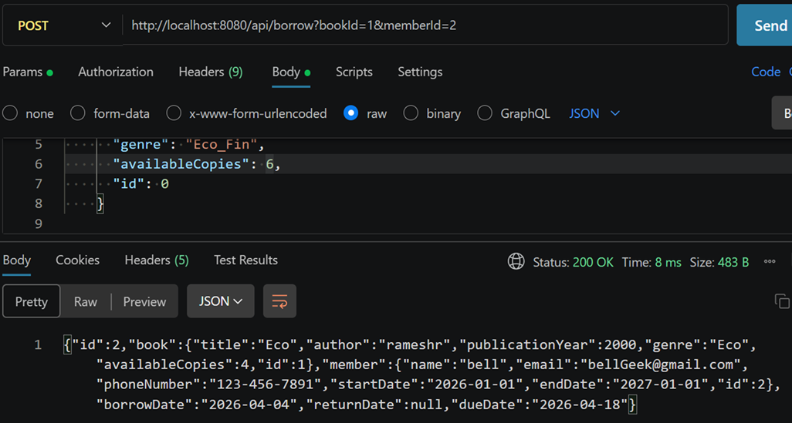
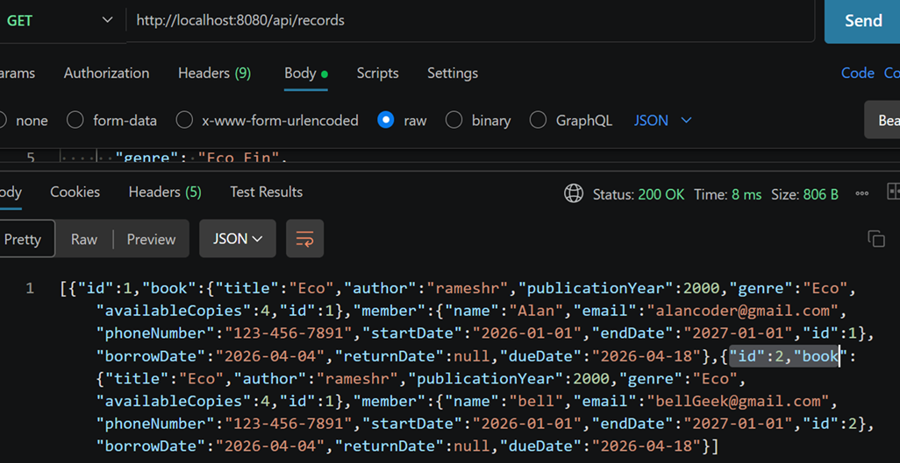
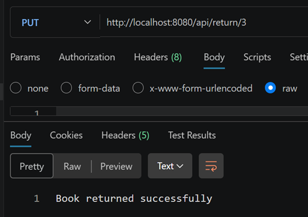
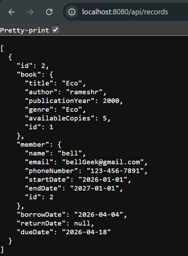

# 📚 LMS - Version 2 (Improved)

This version improves the system by adding proper structure and real-world logic.

---

## 🚀 Features

### 📖 Book Management
- Add Book
- Get Book (by ID & Name)
- Update Book
- Delete Book

---

### 👨‍🎓 Member Management
- Add Member
- Get Member
- Update Member
- Delete Member

---

### 🔄 Borrow System
- Borrow book using Book ID & Member ID
- Return book
- Auto update available copies

---

### 🔍 Advanced Queries
- Get members who borrowed a specific book
- Get books issued to a specific member

---

## 🧱 Architecture
# 📚 LMS - Version 2 (Improved)

This version improves the system by adding proper structure and real-world logic.

---

## 🚀 Features

### 📖 Book Management
- Add Book
- Get Book (by ID & Name)
- Update Book
- Delete Book

---

### 👨‍🎓 Member Management
- Add Member
- Get Member
- Update Member
- Delete Member

---

### 🔄 Borrow System
- Borrow book using Book ID & Member ID
- Return book
- Auto update available copies

---

### 🔍 Advanced Queries
- Get members who borrowed a specific book
- Get books issued to a specific member

---

## 🧱 Architecture
# 📚 LMS - Version 2 (Improved)

This version improves the system by adding proper structure and real-world logic.

---

## 🚀 Features

### 📖 Book Management
- Add Book
- Get Book (by ID & Name)
- Update Book
- Delete Book

---

### 👨‍🎓 Member Management
- Add Member
- Get Member
- Update Member
- Delete Member

---

### 🔄 Borrow System
- Borrow book using Book ID & Member ID
- Return book
- Auto update available copies

---

### 🔍 Advanced Queries
- Get members who borrowed a specific book
- Get books issued to a specific member

---

## 🧱 Architecture
Controller → Service → Repository


---

## 🛠 Improvements Over V1

✔ Repository Layer added  
✔ Separation of concerns  
✔ Optional used for safe handling  
✔ Logging added (SLF4J)  
✔ Update & Delete operations  
✔ Borrow/Return logic  
✔ "Not Found" cases handled  

---

## ⚠️ Error Handling

- Book not found → returns message
- Member not found → handled
- Borrow fails if:
  - Book not found
  - Member not found
  - No copies available

---

## 🔧 Example APIs

### Borrow Book

---

## 🛠 Improvements Over V1

✔ Repository Layer added  
✔ Separation of concerns  
✔ Optional used for safe handling  
✔ Logging added (SLF4J)  
✔ Update & Delete operations  
✔ Borrow/Return logic  
✔ "Not Found" cases handled  

---

## ⚠️ Error Handling

- Book not found → returns message
- Member not found → handled
- Borrow fails if:
  - Book not found
  - Member not found
  - No copies available

---

## 🔧 Example APIs

### Borrow Book

---

## 🛠 Improvements Over V1

✔ Repository Layer added  
✔ Separation of concerns  
✔ Optional used for safe handling  
✔ Logging added (SLF4J)  
✔ Update & Delete operations  
✔ Borrow/Return logic  
✔ "Not Found" cases handled  

---

## ⚠️ Error Handling

- Book not found → returns message
- Member not found → handled
- Borrow fails if:
  - Book not found
  - Member not found
  - No copies available

---

## 🔧 Example APIs

### Borrow Book
POST /api/borrow?bookId=1&memberId=1


---

### Return Book

---

### Return Book


---

## 🧠 Key Concepts Learned

- Layered architecture
- Optional usage
- Business logic in Service layer
- Relationship handling (Book ↔ Member)
- Clean API design

---

## ❗ Limitations

- Still uses in-memory storage
- No database
- No authentication

---

## 🚀 Next Version

- H2 / MySQL integration
- Spring Data JPA
- Exception handling
- JWT security


---

*****************************************************

## OP images

1- Book borrowed by member with bookId, memberId
•	Bkid 1 , mbr id 1
http://localhost:8080/api/borrow?bookId=1&memberId=1

<p align="center">
  
</p>

---

2- See all records on postman - using GET … 

2 Copies of book one is borrowed , so copies of it is  reduced from 6 to 4 --- 
"availableCopies":4
<p align="center">
  
</p>

apznek1


2b **** see all records on browser

```
[
  {
    "id": 1,
    "book": {
      "title": "Eco",
      "author": "rameshr",
      "publicationYear": 2000,
      "genre": "Eco",
      "availableCopies": 4,
      "id": 1
    },
    "member": {
      "name": "Alan",
      "email": "alancoder@gmail.com",
      "phoneNumber": "123-456-7891",
      "startDate": "2026-01-01",
      "endDate": "2027-01-01",
      "id": 1
    },
    "borrowDate": "2026-04-04",
    "returnDate": null,
    "dueDate": "2026-04-18"
  },
  {
    "id": 2,
    "book": {
      "title": "Eco",
      "author": "rameshr",
      "publicationYear": 2000,
      "genre": "Eco",
      "availableCopies": 4,
      "id": 1
    },
    "member": {
      "name": "bell",
      "email": "bellGeek@gmail.com",
      "phoneNumber": "123-456-7891",
      "startDate": "2026-01-01",
      "endDate": "2027-01-01",
      "id": 2
    },
    "borrowDate": "2026-04-04",
    "returnDate": null,
    "dueDate": "2026-04-18"
  }
]

```

---

3- Return a book, using POST

<p align="center">
  
</p>
--- 

4- Op on browser , after returning book – 
only 1 record now … after book1 returned

<p align="center">
  
</p>

---
**********************************************************
**********************************************************
