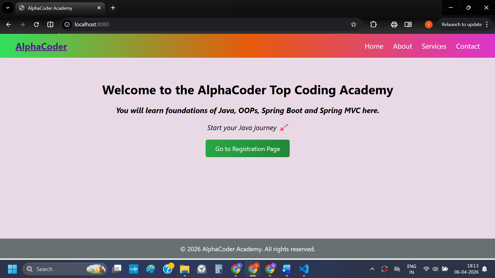
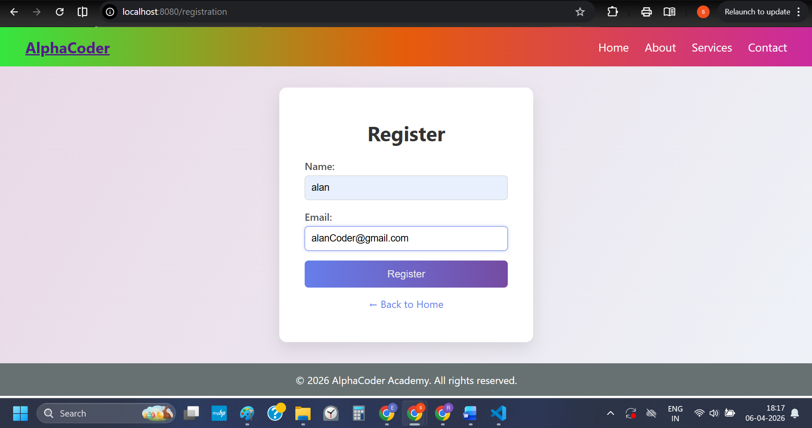
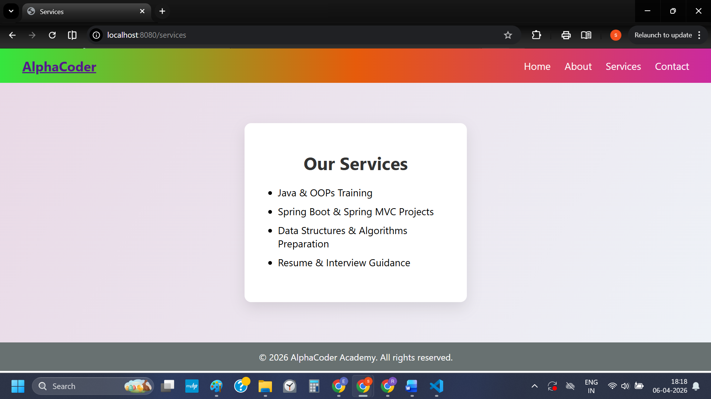

# 🚀 AlphaCoder Academy - Spring Boot MVC Project

A **Spring Boot MVC web application** built using **Thymeleaf** for dynamic UI rendering.
This project demonstrates a basic multi-page web application with **user registration**, navigation, and clean UI design.

---

## 📌 Features

* 🏠 Home Page
* 📝 User Registration Form
* ℹ️ About Page
* 🛠 Services Page
* 📞 Contact Page
* 🎨 Responsive UI with modern CSS
* 🔄 Dynamic data binding using Thymeleaf

---

## 🛠 Tech Stack

* **Backend:** Java, Spring Boot, Spring MVC
* **Frontend:** HTML, CSS, Thymeleaf
* **Build Tool:** Maven

---

## 📂 Project Structure

```
src/
 └── main/
      ├── java/com/alphacoder/
      │       └── Controller/
      │             └── AcadAppnController.java
      │
      └── resources/
            ├── templates/
            │     ├── index.html
            │     ├── registration.html
            │     ├── about.html
            │     ├── services.html
            │     └── contact.html
            │
            └── static/
                  └── css/
                        └── styles.css
                        └── regstyles.css
```

```
 ├── readme.md
 └── images/
      ├── home.png
      ├── regtn.png
```


---

## ⚙️ How It Works (MVC FLOW)

#### 🔁 FLOW 
```
User → Controller → Model → View → User
```

#### DETAIL FLOW
```
User Action
   ↓
Controller (handles request)
   ↓
Model (data)
   ↓
View (Thymeleaf HTML)
   ↓
User sees output
```


#### 🔁 Example Flow for registration:
1. User opens `/registration`
2. Controller returns `registration.html`
3. User submits form
4. Controller processes data
5. Response shown on home page

#### Example (Registration Feature Thinking)
User clicks register
→ Need GET /registration
→ Show form (HTML)

User submits form
→ Need POST /register
→ Get name/email
→ Show success message

---

## 🔗 Key Endpoints

| Endpoint        | Method | Description            |
| --------------- | ------ | ---------------------- |
| `/`             | GET    | Home Page              |
| `/registration` | GET    | Registration Page      |
| `/register`     | POST   | Handle Form Submission |
| `/about`        | GET    | About Page             |
| `/services`     | GET    | Services Page          |
| `/contact`      | GET    | Contact Page           |

---

## 🧠 Thymeleaf Usage

| Syntax      | Purpose              |
| ----------- | -------------------- |
| `th:text`   | Display dynamic data |
| `th:href`   | Dynamic links        |
| `th:action` | Form submission      |
| `${}`       | Access backend data  |
| `@{}`       | URL mapping          |

---

## ▶️ How to Run

1. Clone the repository:

```
git clone https://github.com/your-username/alphacoder-academy.git
```

2. Navigate to the project:

```
cd alphacoder-academy
```

3. Run the application:

```
mvn spring-boot:run
```

4. Open in browser:

```
http://localhost:8080/
```

---

## 📸 Screens / Op

* Home Page
<h4 align="center">Home Page</h4>
<p align="center">
  
</p>

* Registration Form
<h4 align="center">Reg. Page</h4>
<p align="center">
  
</p>

* Services Page
<h4 align="center">Service Page</h4>
<p align="center">
  
</p>

---

## 🚀 Future Improvements (ver2)

* ✅ Add Validation (`@Valid`)
* ✅ Integrate Database (MySQL + JPA)
* ✅ User Login System
* ✅ REST API integration
* ✅ Deployment (AWS / Render)

---

## 👨‍💻 Author

**AlphaCoder (Java Developer Aspirant)**
**** Learned from IBM JAVA PROF. CRTI ON COURSERA.

---

## ⭐ Final Note

This project is built to strengthen **Spring Boot MVC fundamentals** and demonstrate **real-world web application structure** for interviews and development practice.

---

💡 *“Learn. Build. Grow.”*

---
## MISCELANEOUS 

### THYMLEAF THEORY

🚀 3️⃣ Thymeleaf — What & Why?

#### ✅ What is Thymeleaf?
👉 A template engine used in Spring Boot to create dynamic HTML

🧠 Simple Definition:
👉 “Thymeleaf = HTML + dynamic data from backend”

🔥 4️⃣ Thymeleaf Syntax Used in YOUR Project

#### 1️⃣ th:href
<a th:href="@{/registration}">
✅ Meaning:
👉 Generates URL dynamically
<a href="/registration">

#### 2️⃣ th:text
<p th:text="${message}"></p>
✅ Meaning:
👉 Replace content with backend data
Example:
message = "Hello"
👉 Output:
<p>Hello</p>

#### 3️⃣ th:action
<form th:action="@{/register}" method="post">
✅ Meaning:
👉 Form submits to /register

#### 4️⃣ th:href="@{/}"
<a th:href="@{/}">
👉 Goes to home page /

#### 5️⃣ Date Example
<span th:text="${#dates.format(#dates.createNow(), 'yyyy')}"></span>
✅ Meaning:
👉 Show current year dynamically

---

### 🚀 5️⃣ Why this is MVC Project?
🔥 MVC = Model + View + Controller

#### 🧠 In YOUR project:
#### ✅ Model
👉 Data
model.addAttribute("message", ...)

#### ✅ View
👉 HTML (Thymeleaf)
index.html
registration.html

#### ✅ Controller
👉 Handles request
@GetMapping("/")
@PostMapping("/register")

#### 🔁 FLOW (VERY IMPORTANT)
User → Controller → Model → View → User

---
### 🚀 1️⃣ AcadAppnController.java —  Explanation

#### @Controller
public class AcadAppnController {

#### ✅ @Controller
Marks this class as a Spring MVC Controller
It returns HTML pages (views), not JSON

#### 🔹 Home API
@GetMapping("/")
public String home(Model model) {
    model.addAttribute("message", "Start your Java journey 🚀");
    return "index";
}

####  🔍 Explanation:
1. @GetMapping("/")
👉 When user visits:
http://localhost:8080/
This method runs.

2. Model model
👉 Used to send data from backend → frontend (HTML)

3. model.addAttribute(...)
model.addAttribute("message", "Start your Java journey 🚀");
👉 This data is available in HTML as:
<p th:text="${message}"></p>

4. return "index";
👉 Means:
templates/index.html

#### 🔹 Registration Page
@GetMapping("/registration")
public String registration() {
    return "registration";
}

👉 Opens:
templates/registration.html

#### 🔹 Handle Form Submit
@PostMapping("/register")
public String handleRegistration(
        @RequestParam String name,
        @RequestParam String email,
        Model model) {

#### 🔍 Explanation:
1. @PostMapping("/register")
👉 Triggered when form submits:
<form th:action="@{/register}" method="post">

2. @RequestParam
@RequestParam String name
👉 Gets form data:
<input name="name">

3. Add response message
model.addAttribute("message",
    "Successfully Registered: " + name);

4. Return page
return "index";
👉 Redirects user to home page with message

#### 🎯 2️⃣ Why @Controller NOT @RestController?

🔥 Key Difference
```
Feature	    @Controller 	@RestController
Output	    HTML (view)	        JSON
Use case	Web app (UI)	APIs
```

🧠 In project:
HTML pages
Thymeleaf templates

👉 So you need:
✔ @Controller
❌ If you used @RestController
return "index";

👉 Output in browser:
index
💥 Not HTML page → WRONG

---


**************************************
**************************************
