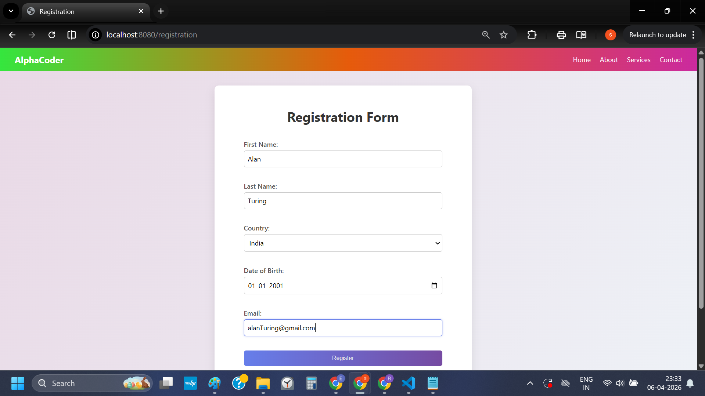
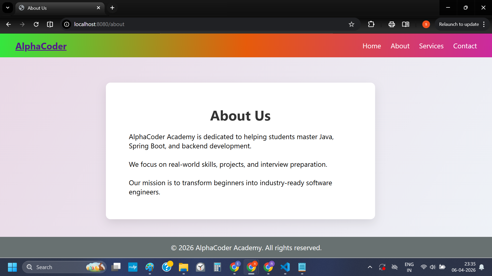

# 🚀 AlphaCoder Academy (Ver 2)

### Spring Boot MVC + Thymeleaf + Validation Project

---

## 📌 Overview

This is an enhanced version of the **AlphaCoder Academy web application**, built using **Spring Boot MVC architecture** with **Thymeleaf** and **Spring Validation**.

Version 2 introduces:

* ✅ Form Binding using `@ModelAttribute`
* ✅ Input Validation using `@Valid`
* ✅ Error Handling with `BindingResult`
* ✅ Clean UI with consistent styling
* ✅ Multi-page navigation

---

## 🛠 Tech Stack

* **Backend:** Java, Spring Boot, Spring MVC
* **Frontend:** HTML, CSS, Thymeleaf
* **Validation:** Jakarta Bean Validation (Hibernate Validator)
* **Build Tool:** Maven

---

## 📂 Project Structure

```id="a1v2st"
src/
 └── main/
      ├── java/com/app/webdemo/
      │       ├── controller/
      │       │      └── AcadAppnController.java
      │       ├── model/
      │       │      └── RegistrationForm.java
      │
      └── resources/
            ├── templates/
            │     ├── index.html
            │     ├── registration.html
            │     ├── about.html
            │     ├── services.html
            │     └── contact.html
            │
            └── static/
                  └── css/
                        └── styles.css
```

---

## 🚀 Features

* 📝 User Registration Form
* ✅ Form Validation (Name, Email, DOB, Country)
* ❌ Error Display in UI
* 🔗 Navigation (Home, About, Services, Contact)
* 🎨 Modern UI with Flexbox

---

## 🔁 MVC Architecture

```id="mvcflowv2"
User → Controller → Model → View → Response
```

### Flow:

1. User opens `/registration`
2. Controller sends empty `RegistrationForm`
3. User fills form
4. Data binds to object using `@ModelAttribute`
5. Validation triggered using `@Valid`
6. Errors handled via `BindingResult`
7. Response rendered using Thymeleaf

---

## 🧠 Key Concepts

---

### 🔷 1. Thymeleaf (Template Engine)

👉 Used to render dynamic HTML

#### Common Syntax:

| Syntax      | Purpose                |
| ----------- | ---------------------- |
| `th:text`   | Display data           |
| `th:href`   | Dynamic links          |
| `th:action` | Form submission        |
| `th:object` | Bind form to object    |
| `th:field`  | Bind input to field    |
| `th:errors` | Show validation errors |

---

### 🔷 2. Form Binding

```id="formbind"
@ModelAttribute("registrationForm") RegistrationForm form
```

👉 Automatically maps form data → Java object

---

### 🔷 3. Validation (Spring Boot)

#### Annotations Used:

```id="valann"
@NotBlank
@Email
@Past
```

#### Flow:

```id="valflow"
Form → Object → @Valid → BindingResult → View
```

👉 If invalid → show errors
👉 If valid → process data

---

### 🔷 4. DispatcherServlet

👉 Core component of Spring MVC

```id="dispatchflow"
Client → DispatcherServlet → Controller → View → Client
```

👉 Acts as a **Front Controller** handling all requests

---

### 🔷 5. LocalDate vs Date

| Feature       | Date | LocalDate |
| ------------- | ---- | --------- |
| API           | Old  | Modern    |
| Thread-safe   | ❌    | ✔         |
| Includes Time | ✔    | ❌         |

---

## 🔗 Endpoints

| Endpoint        | Method | Description   |
| --------------- | ------ | ------------- |
| `/`             | GET    | Home Page     |
| `/registration` | GET    | Show Form     |
| `/register`     | POST   | Submit Form   |
| `/about`        | GET    | About Page    |
| `/services`     | GET    | Services Page |
| `/contact`      | GET    | Contact Page  |

---

## 🎨 UI Highlights

* Flexbox-based Navbar
* Card-style Form Layout
* Inline Validation Errors (Red text)
* Consistent Input Styling

---

## ▶️ How to Run

### Option 1 (Maven Wrapper)

```id="run1"
./mvnw spring-boot:run
```

### Option 2 (If Maven Installed)

```id="run2"
mvn spring-boot:run
```

### Open in browser:

```id="run3"
http://localhost:8080/
```

---

## ⚠️ Common Issues

| Issue                  | Solution                            |
| ---------------------- | ----------------------------------- |
| Validation not working | Add `@Valid` + dependency           |
| Thymeleaf error        | Ensure `model.addAttribute` present |
| mvn not recognized     | Use `mvnw`                          |

---

---

## 📸 Screens / Op

* Home Page
<h4 align="center">Home Page</h4>
<p align="center">
  
</p>

* Registration Form
<h4 align="center">Reg. Page</h4>
<p align="center">
  
</p>

* About Page
<h4 align="center">Service Page</h4>
<p align="center">
  
</p>

---

## 🚀 Future Enhancements

* 🔐 Login & Authentication (Spring Security)
* 💾 Database Integration (MySQL + JPA)
* 📧 Email Verification
* 🌐 REST API Integration
* ☁️ Deployment (AWS / Render)

---
---


## Miscellaneous


### ^^^^^^^^^^^^^^^^^^^^^^^ QUERY 1  ^^^^^^^^^^^^^^^^^^^^^^^^^^^^^^^^^^

### 🧠 NEW CONCEPTS YOU LEARNED (VERY IMPORTANT)

🔥 1. @ModelAttribute
👉 Binds form → Java object
________________________________________
🔥 2. @Valid
👉 Triggers validation
________________________________________
🔥 3. BindingResult
👉 Holds validation errors
________________________________________
🔥 4. th:object
👉 Connects form ↔ object
________________________________________
🔥 5. th:field
👉 Binds input ↔ field
________________________________________
🎯 FLOW (NOW ADVANCED)
Form → RegistrationForm.java → Validation → Controller → View
________________________________________

Next upgrade recommended:
👉 Save data to DB (JPA + MySQL)
👉 Show list of users
👉 Add login system
________________________________________

--- 

### ^^^^^^^^^^^^^^^^^^^^^^^ QUERY 2  ^^^^^^^^^^^^^^^^^^^^^^^^^^^^^^^^^^

Explained clearly in 3 styles:
👉 Layman → Points → Technical (interview-ready)

________________________________________
🚀 1️⃣ WHAT IS HAPPENING IN YOUR PROJECT (BIG PICTURE)
You implemented:
✔ Form → Java Object binding
✔ Validation using annotations
✔ Error handling in UI
✔ MVC flow

________________________________________
🧠 2️⃣ LAYMAN EXPLANATION (SUPER SIMPLE)
👉 Think like this:
•	User fills form (HTML) 
•	Data goes to Java object (RegistrationForm) 
•	Spring checks: 
o	Is name empty? 
o	Is email valid? 
o	Is date correct? 
•	If ❌ error → show message on same page 
•	If ✅ valid → go to success page 
________________________________________

🔥 3️⃣ STEP-BY-STEP FLOW
```
User fills form
↓
Thymeleaf binds data → RegistrationForm
↓
@Valid checks rules
↓
Errors stored in BindingResult
↓
If errors → show in reg.html
Else → success
```
_____________________________________

#### 🚀 4️⃣ THEORY OF EACH COMPONENT
________________________________________
🔷 1. RegistrationForm.java (Model)
👉 Role:
✔ Stores form data
✔ Defines validation rules
________________________________________
🔥 Annotations Used
1️⃣ @NotBlank
@NotBlank(message = "First Name is required")
👉 Field cannot be:
•	null 
•	empty 
•	spaces 
________________________________________
2️⃣ @Email
@Email(message = "Invalid email")
👉 Checks valid email format
________________________________________
3️⃣ @Past
@Past(message = "DOB must be past")
👉 Date must be before today
________________________________________
4️⃣ @DateTimeFormat
@DateTimeFormat(pattern = "yyyy-MM-dd")
👉 Converts HTML date → Java LocalDate
________________________________________
🧠 Summary:
👉 Model = data + validation rules
________________________________________
🔷 2. registration.html (View)
👉 Role:
✔ Display form
✔ Bind inputs to Java object
✔ Show errors
________________________________________

#### 🔥 Important Thymeleaf Concepts
________________________________________
1️⃣ th:object
<form th:object="${registrationForm}">
👉 Connects form with Java object
________________________________________
2️⃣ th:field
<input th:field="*{firstName}">
👉 Binds input ↔ object field
Equivalent:
HTML input → RegistrationForm.firstName
________________________________________
3️⃣ Error Handling
<span th:if="${#fields.hasErrors('firstName')}"
      th:errors="*{firstName}">
</span>
👉 If error exists → show message
________________________________________
🧠 Summary:
👉 View = UI + data binding + error display
________________________________________
🔷 3. Controller (Logic Layer)
Key Parts:
@Valid @ModelAttribute("registrationForm") RegistrationForm form
________________________________________
🔥 1️⃣ @ModelAttribute
👉 Converts form data → Java object
________________________________________
🔥 2️⃣ @Valid
👉 Triggers validation rules from model
________________________________________
🔥 3️⃣ BindingResult
if (result.hasErrors())
👉 Stores validation errors
________________________________________
🧠 Summary:
👉 Controller = handles request + validation + response
________________________________________

#### 🚀 5️⃣ WHAT IS SPRING VALIDATION?
________________________________________
🧠 Layman:
👉
Spring automatically checks if user input is correct using rules you define.
________________________________________
📌 In Points:
•	Uses Jakarta Validation (JSR-380) 
•	Works with annotations: 
o	@NotBlank 
o	@Email 
o	@Size 
o	@Past 
•	Triggered using @Valid 
•	Errors stored in BindingResult 
•	Errors shown using Thymeleaf 
________________________________________
📖 Technical Definition (INTERVIEW 🔥)
👉
Spring Validation is a framework that integrates Bean Validation (JSR-380) to automatically validate user input using annotations, ensuring data integrity before processing it in the application.
________________________________________
🚀 6️⃣ WHY THIS IS IMPORTANT
🔥 In Real Apps:
•	Prevents bad data 
•	Improves security 
•	Enhances user experience 
________________________________________
🎯 7️⃣ FULL FLOW (INTERVIEW GOLD)
```
User submits form
↓
Spring binds data → Model object (@ModelAttribute)
↓
Validation triggered (@Valid)
↓
Errors stored (BindingResult)
↓
If errors → return same page
↓
Else → process data
```
________________________________________
🧠 FINAL SUMMARY (VERY IMPORTANT)
👉 One-line:
Form → Object → Validation → Errors → Response
________________________________________
🎯 INTERVIEW ANSWERS
________________________________________
❓ What is @Valid?
👉
Triggers validation on the model object.
________________________________________
❓ What is BindingResult?
👉
Stores validation errors.
________________________________________
❓ What is th:field?
👉
Binds HTML input with Java object field.
________________________________________
❓ Why validation?
👉
To ensure correct and safe user input.
________________________________________
❓ Role of RegistrationForm?
👉
Acts as DTO containing data + validation rules.
________________________________________
🚀 NEXT STEP (YOU’RE CLOSE 🔥)
👉 Add:
•	@Size, @Pattern 
•	Custom validation 
•	Database save 
________________________________________

---

### ^^^^^^^^^^^^^^^^^  Query 3 ^^^^^^^^^^^^^^^^^^
________________________________________
🚀 1️⃣ Simple (Layman) Explanation
👉 When you use:
@Email
Spring checks:
✔ Does it look like a valid email?
✔ Format like:
name@domain.com
❌ If not → shows error
________________________________________
🔍 2️⃣ What exactly it checks?
✅ Valid examples:
abc@gmail.com
user123@yahoo.co.in
john.doe@company.org
________________________________________
❌ Invalid examples:
abcgmail.com        ❌ no @
abc@.com            ❌ no domain name
abc@com             ❌ no proper domain
@domain.com         ❌ no username
abc@domain          ❌ no extension
________________________________________
🧠 3️⃣ Technical Explanation
👉 @Email uses Jakarta Bean Validation (Hibernate Validator)
Internally it checks using a regex pattern
________________________________________
🔥 Rough pattern (simplified):
```
^[A-Za-z0-9+_.-]+@[A-Za-z0-9.-]+$
```
________________________________________
Meaning:
```
Part	Meaning
abc 	username
@	    separator
gmail	domain
.com	extension
```
________________________________________
⚠️ IMPORTANT (Very Common Interview Trick)
👉 @Email checks FORMAT only, NOT:
❌ Whether email actually exists
❌ Whether Gmail/Yahoo server is real
❌ Whether inbox is active
________________________________________
💡 Example:
fakeemail123@xyzabc.com
👉 ✔ Passes validation
👉 ❌ But may not exist
________________________________________
🚀 4️⃣ How to make it stricter (ADVANCED)
You can combine with:
@NotBlank
@Email
@Pattern(regexp = "^[A-Za-z0-9+_.-]+@gmail\\.com$")
👉 Only allow Gmail
________________________________________
🔥 5️⃣ Real Industry Approach
Companies do:
1.	✅ Format check (@Email) 
2.	✅ Send OTP / verification mail 
3.	✅ User confirms email 
________________________________________
🎯 6️⃣ Interview Answer (Perfect)
👉
“@Email validates the format of an email address using a regex pattern as per RFC standards, ensuring it follows the structure username@domain, but it does not verify if the email actually exists.”
________________________________________
🧠 Final Memory Trick
👉
Email validation = Format check, not existence check
________________________________________

---


#### ^^^^^^^^^^^^^^^^^^^^^^           QUERY 4          ^^^^^^^^^^^^^^^^^^^^^^^^^^^^^^^^^^

🧠 MODEL COMP. USE ? 
✔ To process business logic and manage application data.
________________________________________
🧠 Explanation (Simple)
👉 In MVC:
•	Model = handles data + logic 
•	It stores data and applies rules (like validation) 
________________________________________
📊 MVC Mapping
Component	Role
Model	Data + Business Logic ✅
View	UI (HTML, Thymeleaf)
Controller	Handles requests
________________________________________
❌ Why others are wrong:
•	To handle user interface rendering → ❌ View 
•	To route requests → ❌ Controller 
•	To provide security → ❌ Security layer (Spring Security) 
________________________________________
🎯 Final Answer:
👉 To process business logic and manage application data.

--- 

#### ^^^^^^^^^^^^^^^^^^^^^^           QUERY 5          ^^^^^^^^^^^^^^^^^^^^^^^^^^^^^^^^^^
👉 Layman → Points → Technical (interview-ready)
________________________________________
🚀 1️⃣ LocalDate dob vs Date dob
🧠 Layman
•	Date = old, confusing, error-prone 
•	LocalDate = modern, clean, only date (no time) 
________________________________________
📌 Points
```
Feature	         Date	      LocalDate
Package	        java.util	    java.time
Time included	  ✔ Yes	       ❌ No
Thread-safe	    ❌ No	      ✔ Yes
Recommended	    ❌ Old	      ✔ Modern
```
________________________________________
🎯 Tech Definition
👉
LocalDate is part of Java 8 Date-Time API, designed to handle date without time in a thread-safe and immutable way, unlike the legacy Date class which is mutable and error-prone.
________________________________________
🚀 2️⃣ <form th:action ... th:object ...>
<form th:action="@{/register}" method="post" th:object="${registrationForm}">
🧠 Layman
👉 “Send form data to /register and connect it with Java object”
________________________________________
📌 Points
•	th:action → where form goes 
•	method="post" → send data 
•	th:object → connect form ↔ Java object 
________________________________________
🎯 Tech Definition
👉
th:object binds the HTML form to a backend model object, enabling automatic data binding between form fields and object properties.
________________________________________
🚀 3️⃣ Input + Error Block
<input type="text" th:field="*{firstName}">
<span th:if="${#fields.hasErrors('firstName')}" th:errors="*{firstName}"></span>
🧠 Layman
👉 User types name → if wrong → show error
________________________________________
📌 Points
•	th:field → bind input to object 
•	#fields.hasErrors → check error 
•	th:errors → show error 
________________________________________
🎯 Tech Definition
👉
th:field binds input elements to object fields, while th:errors dynamically displays validation messages stored in BindingResult.
________________________________________
🚀 4️⃣ Servlet & DispatcherServlet
🧠 Layman
Servlet
👉 “Java program that handles request & response”
DispatcherServlet
👉 “Boss/manager — sends request to correct controller”
________________________________________
📌 Points
Servlet
•	Runs on server 
•	Handles HTTP request 

DispatcherServlet (Spring)
•	Front Controller pattern 
•	Routes request → controller 
•	Handles response 
________________________________________
🔥 Flow
Browser → DispatcherServlet → Controller → View → Browser
________________________________________
🎯 Tech Definition
👉
A Servlet is a server-side Java component that processes client requests, while DispatcherServlet is Spring’s front controller that centralizes request handling and delegates them to appropriate handlers.
________________________________________
🚀 5️⃣ Controller Code (Line-by-Line)
________________________________________
🔹 GET
@GetMapping("/registration")
👉 When user opens /registration
________________________________________
public String registration(Model model)
👉 Method to handle request
________________________________________
model.addAttribute("registrationForm", new RegistrationForm());
👉 Send empty form object to UI
________________________________________
return "registration";
👉 Open registration.html
________________________________________
________________________________________
🔹 POST
@PostMapping("/register")
👉 Called when form submitted
________________________________________
@Valid @ModelAttribute("registrationForm") RegistrationForm form
👉 Bind + validate form
________________________________________
BindingResult result
👉 Holds errors
________________________________________
if (result.hasErrors())
👉 If validation fails
________________________________________
return "registration";
👉 Show form again
________________________________________
model.addAttribute("message", "Successfully Registered...");
👉 Send success message
________________________________________
return "index";
👉 Go to home page
________________________________________
🚀 6️⃣ Why <span> not <p>?
🧠 Layman
👉 span = small inline message
👉 p = big block (breaks layout)
________________________________________
📌 Points
•	span → inline, compact 
•	p → block, adds space 
________________________________________
🎯 Tech Definition
👉
Span is an inline element used for small contextual messages, while paragraph is a block element that disrupts layout flow.
________________________________________
🚀 7️⃣ Flex vs Grid (Navbar)
🧠 Layman
•	Flex = 1 direction (row/column) 
•	Grid = 2D layout 
________________________________________
📌 Points
Flex (used in navbar)
display: flex;
justify-content: space-between;
✔ Best for navbar
________________________________________
Grid
display: grid;
grid-template-columns: repeat(3, 1fr);
✔ Best for layouts (cards, dashboard)
________________________________________
🎯 Tech Definition
👉
Flexbox is a one-dimensional layout system optimized for aligning items in rows or columns, whereas CSS Grid is a two-dimensional system for complex layouts.
________________________________________
🚀 8️⃣ Why model.addAttribute(...) multiple times?
model.addAttribute("firstName", form.getFirstName());
🧠 Layman
👉 Send data to HTML
________________________________________
📌 Points
•	Pass individual fields to UI 
•	Used in success page 
________________________________________
🎯 Tech Definition
👉
Model attributes are key-value pairs used to transfer data from controller to view for rendering dynamic content.
________________________________________
🚀 9️⃣ Model vs Entity vs model.addAttribute
🧠 Layman
•	Model class → data structure 
•	Entity → DB table 
•	Model object → data carrier to UI 
________________________________________
📌 Points
Concept	Meaning
Model class	Java class
Entity	DB mapped class
Model (Spring)	Data container
addAttribute	send data to UI
________________________________________
🎯 Tech Definition
👉
In Spring MVC, the Model is a container that holds attributes for view rendering, distinct from entity classes which map to database tables, and model classes which represent application data.
________________________________________
🔥 FINAL MASTER FLOW
User → Form → Controller → Model → Validation → View → Response
________________________________________
🎯 FINAL INTERVIEW SUMMARY
👉
•	LocalDate > Date (modern API) 
•	Thymeleaf binds form ↔ object 
•	Validation via @Valid 
•	DispatcherServlet routes request 
•	Model sends data to view 
•	Flex for navbar

## 👨‍💻 Author

**AlphaCoder (Java Backend Developer Aspirant)**

---

## ⭐ Interview Ready Summary

👉 This project demonstrates:

* MVC Architecture
* Form Binding
* Validation Handling
* Dynamic UI Rendering

---


💡 *“Build → Understand → Scale → Succeed”*


**************************
**************************
