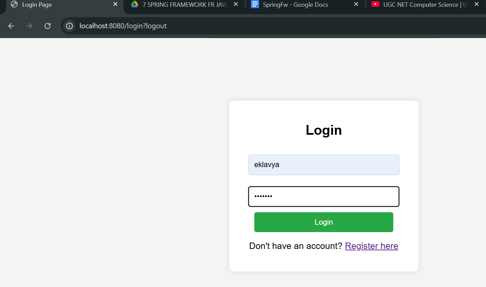
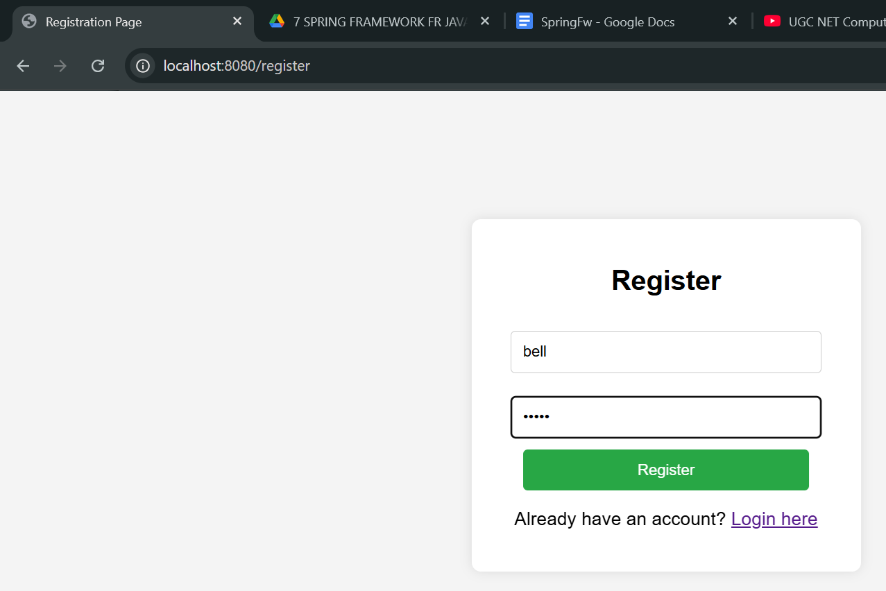
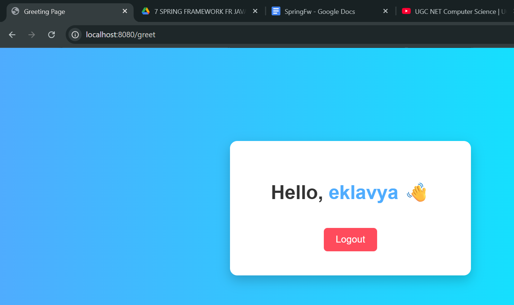

# 🔐 Spring Security Project – Version 1

## 📌 Overview

This is **Version 1** of the Spring Security project where basic authentication is implemented using:

* Spring Boot
* Spring Security
* Thymeleaf

The application allows users to:

* Register
* Login
* Access a protected page after authentication

---

## 🚀 Features

### ✅ User Registration

* Users can create an account with username & password
* Passwords are securely stored using **BCrypt encoding**

### ✅ Custom Login Page

* A custom login page is implemented using Thymeleaf
* Spring Security handles authentication internally

### ✅ Authentication Flow

* User submits credentials
* Spring Security verifies using `UserDetailsService`
* On success → redirected to protected page

### ✅ Protected Endpoint

* `/greet` is accessible **only after login**
* Displays logged-in user's username

---

## 🏗️ Tech Stack

* **Backend:** Spring Boot
* **Security:** Spring Security
* **Frontend:** Thymeleaf (HTML templates)
* **Storage:** In-memory (HashMap)

---

## 📂 Project Structure

```
src/main/java/com/.../
│
├── config/
│   └── WebSecurityConfig.java
│
├── controller/
│   └── GreetingController.java
│
├── service/
│   └── CustomUserDetailsService.java
│
├── model/
│   └── User.java
│
src/main/resources/
│
├── templates/
│   ├── login.html
│   ├── register.html
│   └── greet.html
```

---

## 🔄 Application Flow

1. User opens `/login`
2. New user → registers via `/register`
3. Credentials stored (in-memory)
4. User logs in
5. Spring Security authenticates user
6. On success → redirected to `/greet`
7. Username displayed on UI

---

## 🔐 Security Concepts Used

* Authentication (username & password)
* Password Encoding (BCrypt)
* Custom Login Page
* Secured Endpoint (`/greet`)
* Security Context (session management)

---

## 🖼️ Output Screens

### 🔑 Login Page
<h4 align="center">Login Page</h4>
<p align="center">
  
</p>
<!--  -->

---

### 📝 Register Page
<h4 align="center">Register Page</h4>
<p align="center">
  
</p>
<!--  -->

---

### 🏠 Home / UI Page
<h4 align="center">Greet Page after login</h4>
<p align="center">
  
</p>
<!--  -->

---


## ⚙️ How to Run

1. Clone the repository
2. Open in IDE (IntelliJ / Eclipse)
3. Run the Spring Boot application
4. Open browser:

```
http://localhost:8080/login
```

---

## ⚠️ Limitations (Version 1)

* No database (uses in-memory storage)
* No role-based access control
* No REST APIs (only MVC + Thymeleaf)

---

## 🔮 Next Version (Planned)

Version 2 will include:

* Role-based access (Admin / Staff)
* Authorization rules based on roles

---
apznek1
---

## 💡 Learning Outcome

This version helps understand:

* How Spring Security works internally
* Authentication flow
* Integration with Thymeleaf
* Basic security configuration

---

## 👨‍💻 Author
alpha1zln
Learned from IBM JAVA COURSE on Coursera.
---

*******************