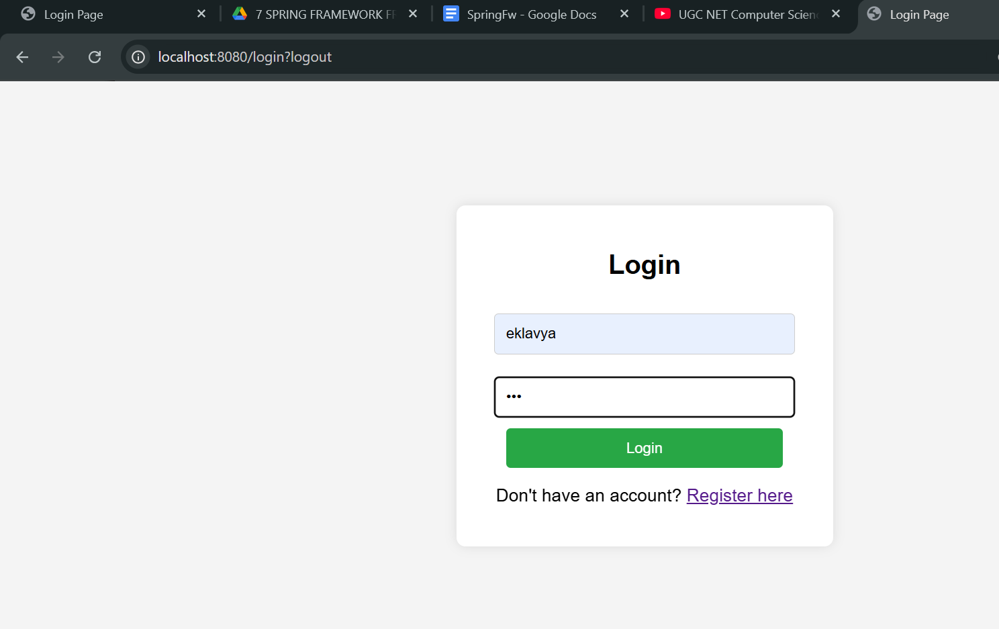
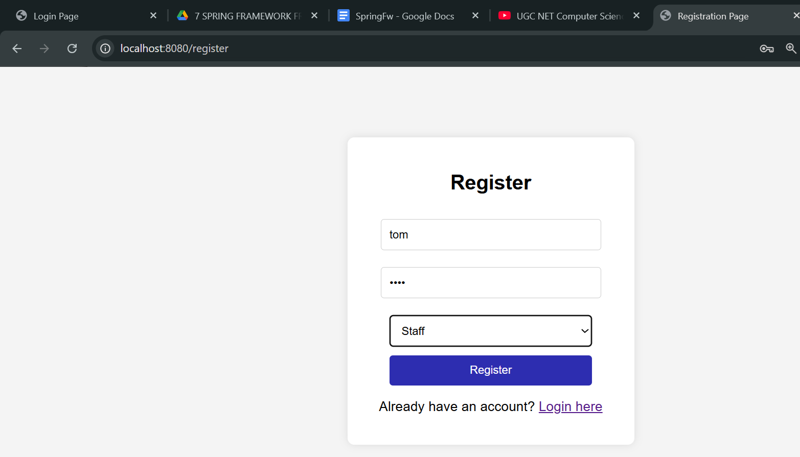
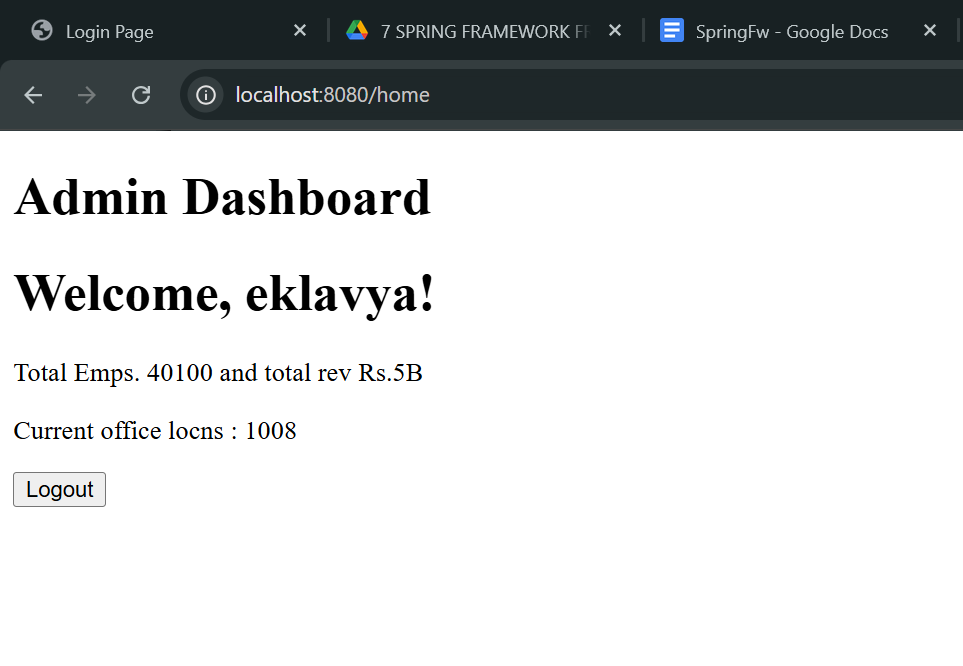

# 🔐 Spring Security Project – Version 2 (Role-Based Access)

## 📌 Overview

This is **Version 2** of the Spring Security project, extending Version 1 by adding **Role-Based Access Control (RBAC)**.

The application now supports:

* User Registration & Login
* Role-based authorization (e.g., ADMIN, STAFF)
* Protected endpoints based on roles
* Dynamic UI rendering using Thymeleaf

---

## 🚀 Features

### ✅ User Registration & Login

* Users can register with username & password
* Passwords are securely stored using **BCrypt encoding**
* Authentication handled by Spring Security

---

### ✅ Role-Based Access Control (RBAC)

* Users are assigned roles (e.g., `ROLE_ADMIN`, `ROLE_STAFF`)
* Access to endpoints is restricted based on roles

#### Example:

* `/admin/**` → Only accessible by **ADMIN**
* `/staff/**` → Accessible by **STAFF & ADMIN**
* `/greet` → Any authenticated user

---

### ✅ Secured Endpoints

* Unauthorized access is blocked with **403 Forbidden**
* Only users with correct roles can access specific pages

---

### ✅ Dynamic UI (Thymeleaf)

* UI can be customized based on roles
* Example:

  * Show admin panel only for ADMIN users
  * Hide restricted sections for others

---

## 🏗️ Tech Stack

* **Backend:** Spring Boot
* **Security:** Spring Security (RBAC)
* **Frontend:** Thymeleaf
* **Storage:** In-memory (HashMap) *(can be replaced with DB later)*

---

## 📂 Project Structure

```id="9xt2s0"
src/main/java/com/.../
│
├── config/
│   └── WebSecurityConfig.java
│
├── controller/
│   └── GreetingController.java
│
├── service/
│   └── CustomUserDetailsService.java
│
├── model/
│   └── User.java
│
src/main/resources/
│
├── templates/
│   ├── login.html
│   ├── register.html
│   ├── greet.html
│   ├── admin.html
│   └── staff.html
```

---

## 🔄 Application Flow

1. User opens `/login`
2. New user registers via `/register`
3. User is assigned a role (ADMIN / STAFF)
4. User logs in
5. Spring Security authenticates user
6. Authorization check:

   * If role matches → access granted ✅
   * Else → **403 Forbidden ❌**
7. User redirected to respective dashboard/page

---

## 🔐 Security Concepts Used

* Authentication (login verification)
* Authorization (role-based access)
* Password Encoding (BCrypt)
* SecurityFilterChain configuration
* Role-based URL protection
* Security Context (session handling)

---

## 🧪 Sample Authorization Rules

```java id="k9km1p"
.requestMatchers("/admin/**").hasRole("ADMIN")
.requestMatchers("/staff/**").hasAnyRole("ADMIN", "STAFF")
.requestMatchers("/greet").authenticated()
```

---

## 🖼️ Output Screens

### 🔑 Login Page
<h4 align="center">Service Page</h4>
<p align="center">
  
</p>
<!--  -->

---

### 📝 Registration Page
<h4 align="center">Service Page</h4>
<p align="center">
  
</p>
<!--  -->

---

### 🏠 Home / UI Page
<h4 align="center">Service Page</h4>
<p align="center">
  
</p>
<!--  -->

---

## ⚙️ How to Run

1. Clone the repository
2. Open in IDE
3. Run Spring Boot application
4. Open browser:

```id="5jz0z4"
http://localhost:8080/login
```

---

## ⚠️ Limitations (Version 2)

* In-memory user storage (data lost on restart)
* No JWT / stateless authentication
* No database integration

---

## 🔮 Future Enhancements

* Database integration (MySQL + JPA)
* JWT Authentication (stateless security)
* Role management UI
* REST API support
* Production-level security best practices

---

## 💡 Learning Outcome

This version helps understand:

* Role-based authorization in Spring Security
* Difference between authentication & authorization
* Securing endpoints using roles
* Dynamic UI rendering based on user roles

---

## 👨‍💻 Author

alpha1zln
Learned on IBM Java Prof. Certi. course on Coursera.
---

*****************************************
*****************************************
